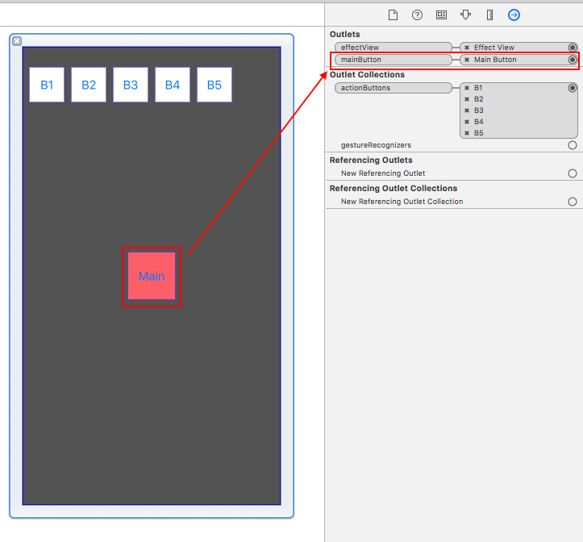

[](LICENSE)
[](https://www.paypal.com/cgi-bin/webscr?cmd=_s-xclick&hosted_button_id=LC58N7VZUST5N)
[](https://github.com/Carthage/Carthage)


# SRPPopupMenu

[中文說明](README/README_TW.md)

A dragable, easy customizable, popup menu.


## Install
Use Carthage or drag SRPPopupMenu.h/.m into your project.


## Usage
You should use your own menu, not SRPPopupMenu.

Follow the steps to create your custom menu or reference the [DemoMenu][3] class.


### Step1
Create your custom menu subclass SRPPopupMenu.


### Step2
Create a xib file named as your custom menu class name.

**Disable** the AutoLayout and Size-Class.


Drag a button to be MainButton, and connect to IBOutlet.




Drag some buttons to be otherButtons, and conncet to IBCollections.


Now you can use your custom menu.

```objc
// Show the menu
[YourMenu show];

// Hide the menu
[YourMenu hide];
```

## Handle animation duration, damping

**Setup the follow property programmatically or on xib file**

```objc
- (void)awakeFromNib
{
    [super awakeFromNib];
    self.mainButtonAnimationDuration = 0.4;
    self.mainButtonAnimationDamping = 0.4;
    self.actionButtonsAnimationDuration = 0.4;
    self.actionButtonsAnimationDamping = 0.4;
    self.actionButtonsPosionStartAngle = -90.0;
    self.actionButtonsDistanceFromCenter = 120.0;
}
```


## Handle button clicked
The SRPPopupMenu using NSNotification to handle button clicked,

```objc
- (void)viewDidLoad
{
    [super viewDidLoad];

    [[NSNotificationCenter defaultCenter]addObserver:self
                                            selector:@selector(__menuButtonClickedNotification:)
                                                name:SRPPopupMenuButtonClickedNotification
                                              object:nil];
    
    
}

- (void)__menuButtonClickedNotification:(NSNotification *)sender
{
    UIButton *button = sender.object;
}
```


## Handle menu open / close
If you want to handle the menu open / close, you must implement the SRPPopupMenuProtocol methods.

Also see [DemoMenu][3] class.

```objc
// Menu will open
- (void)menuWillOpen

// Menu opened
- (void)menuDidOpen

// Menu will close
- (void)menuWillClose

// Menu closed
- (void)menuDidClose
```


[3]: Demo/CustomMenu/DemoMenu.m "DemoMenu"
