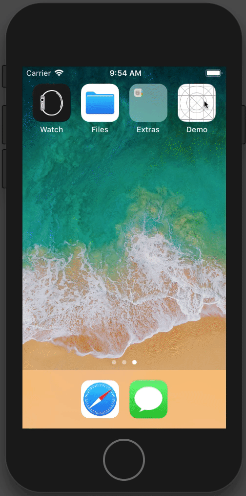
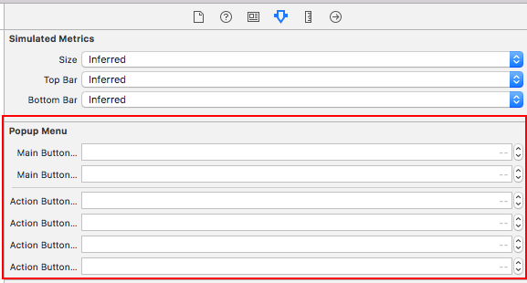

[](LICENSE)
[](https://www.paypal.com/cgi-bin/webscr?cmd=_s-xclick&hosted_button_id=LC58N7VZUST5N)
[](https://github.com/Carthage/Carthage)


# SRPPopupMenu

可拖動, 簡易客製化的彈跳選單.




## 安裝
使用 Carthage 或是將 SRPPopupMenu.h/.m 拖拉進你的專案.


## 使用
你應該使用你的客製化 menu class 而不是使用 SRPPopupMenu.

按照下面步驟建立你自己的客製化選單, 或是參考 [DemoMenu][3] class.


### 步驟1
創建一個繼承 SRPPopupMenu 的 class.


### 步驟2
創建一個 xib 檔案, 並命名跟步驟1 class 相同主檔名/

**取消使用** AutoLayout 跟 Size-Class.


拖拉一個按鈕, 當 Main button, 並關聯 IBOutlet.


拖拉幾個按鈕, 當 Action button, 並關聯 IBOutlet


設置完成就可以使用你的選單了.

```objc
// Show the menu
[YourMenu show];

// Hide the menu
[YourMenu hide];
```

## 處理按鈕動畫時間與彈跳

**手動設置以下 Property, 或是在 xib 檔案設置**

```objc
- (void)awakeFromNib
{
    [super awakeFromNib];
    self.mainButtonAnimationDuration = 0.4;
    self.mainButtonAnimationDamping = 0.4;
    self.actionButtonsAnimationDuration = 0.4;
    self.actionButtonsAnimationDamping = 0.4;
    self.actionButtonsPosionStartAngle = -90.0;
    self.actionButtonsDistanceFromCenter = 120.0;
}
```



## 處理按鈕點擊事件
使用 NSNotification 監聽按鈕點擊事件.

```objc
- (void)viewDidLoad
{
    [super viewDidLoad];

    [[NSNotificationCenter defaultCenter]addObserver:self
                                            selector:@selector(__menuButtonClickedNotification:)
                                                name:SRPPopupMenuButtonClickedNotification
                                              object:nil];
    
    
}

- (void)__menuButtonClickedNotification:(NSNotification *)sender
{
    UIButton *button = sender.object;
}
```


## 處理選單開啟/關閉
實作 SRPPopupMenuProtocol method, 並監聽即可.

可參考 [DemoMenu][3] class.

```objc
// Menu will open
- (void)menuWillOpen

// Menu opened
- (void)menuDidOpen

// Menu will close
- (void)menuWillClose

// Menu closed
- (void)menuDidClose
```


[3]: Demo/CustomMenu/DemoMenu.m "DemoMenu"
