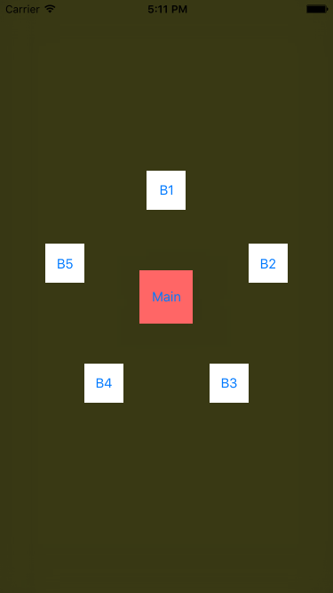
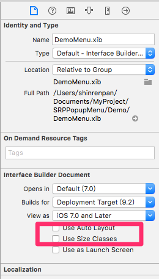
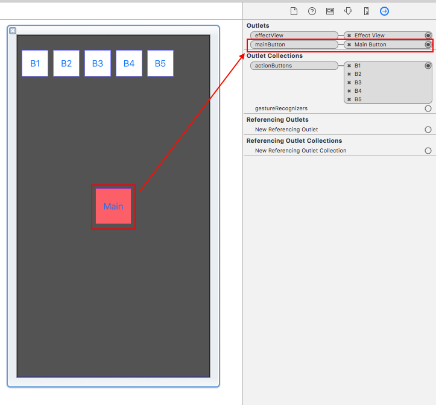
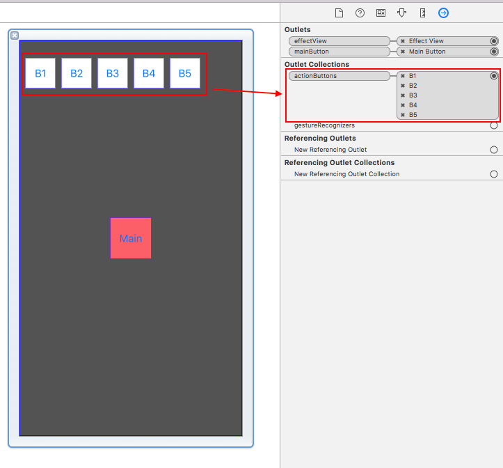

[](LICENSE)
[](https://www.paypal.com/cgi-bin/webscr?cmd=_s-xclick&hosted_button_id=LC58N7VZUST5N)
[](https://github.com/Carthage/Carthage)


# SRPPopupMenu

可拖動, 容易客製化的彈跳選單.

線上 [Demo][1] power by [appetize][2]




# 使用
你應該使用你客製化的選單, 而不是使用 SRPPopupMenu.

依照以下步驟完成你的客製化選單, 或是參考 [DemoMenu][3] class.


## 步驟1
創建你的選單 class 並繼承 SRPPopupMenu.

覆寫 `awakeFromNib` method, 並設置相關動畫的屬性.

> **別忘記呼叫 `[super awakeFromNib]`.**

```ObjC
- (void)awakeFromNib
{
    [super awakeFromNib];
    
    self.otherButtonsAnimationDuration  = .5f;
    self.otherButtonsAnimationDamping   = .4f;
    self.otherButtonsPosionStartAngle   = -90.0f;
    self.othersButtonDistanceFromCenter = 120.0f;
    self.mainButtonAnimationDuration    = .5f;
    self.mainButtonAnimationDamping     = .6f;
}
```


## 步驟2
創建一個 xib 檔案, 並命名與你所創建的選單 class 名稱相同.

取消 xib 的 AutoLayout 及 Size-Class.




拖拉一個按鈕當作 MainButton, 並且設置 IBOutlet 關聯.




拖拉多個按鈕當作 OtherButtons, 並設置 IBCollections 關聯.

> **重要: 你必須設置 OtherButtons 的 tag, 從 1 到 N.**




設置完後就可開始使用你的客製化選單了.

```Objc
// Show the menu
[[YourMenu singleton]show];

// Hide the menu
[[YourMenu singleton]hide];
```


# 處理按鈕點擊
SRPPopupMenu 使用 NSNotification 來監聽按鈕點擊.

```ObjC
- (void)viewDidLoad
{
    [super viewDidLoad];

    [[NSNotificationCenter defaultCenter]addObserver:self
                                            selector:@selector(__menuButtonClickedNotification:)
                                                name:SRPPopupMenuButtonClickedNotification
                                              object:nil];
    
    
}

- (void)__menuButtonClickedNotification:(NSNotification *)sender
{
    NSNumber *tag = sender.object;
    NSLog(@"%@", tag);
}
```


# 處理選單開啟 / 關閉
如果你想處理選單開啟或是關閉的過程, 你應該實作 SRPPopupMenuProtocol method.  
或是參考 [DemoMenu][3].

```ObjC
// Menu will open
- (void)menuWillOpen

// Menu opened
- (void)menuDidOpen

// Menu will close
- (void)menuWillClose

// Menu closed
- (void)menuDidClose
```


[1]: https://appetize.io/app/u3ppurce2xgyup7r58q9hpxjp0 "Demo"
[2]: https://appetize.io "appetize"
[3]: ../Demo/DemoMenu.m "DemoMenu"